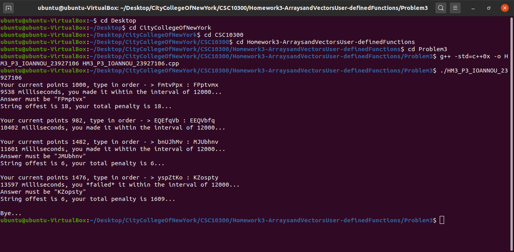

# ASCII Typing Game
<a name="readme-top"></a>

[![Contributors][contributors-shield]][contributors-url]
[![Forks][forks-shield]][forks-url]
[![Stargazers][stars-shield]][stars-url]
[![Issues][issues-shield]][issues-url]
[![MIT License][license-shield]][license-url]
[![LinkedIn][linkedin-shield]][linkedin-url]
[![GitHub][github-shield]][github-url]

<br />
<div align="center">
  

<h3 align="center"><a href="https://github.com/GeorgiosIoannouCoder/ascii-typing-game/blob/main/Ioannou_ASCII_Typing_Game.cpp">ASCII Typing Game</a></h3>

  <p align="center">
    In this programming assignment, I developed an ASCII Typing Game based on the Rules and Requirements defined [here]()
    <br />
    <a href="https://github.com/GeorgiosIoannouCoder/ascii-typing-game"><strong>Explore the docs »</strong></a>
    <br />
    <br />
    <a href="https://github.com/GeorgiosIoannouCoder/ascii-typing-game/issues">Report Bug</a>
    ·
    <a href="https://github.com/GeorgiosIoannouCoder/ascii-typing-game/issues">Request Feature</a>
  </p>
</div>

<details>
  <summary>Table of Contents</summary>
  <ol>
    <li>
      <a href="#about-the-project">About The Project</a>
      <ul>
        <li><a href="#ascii-typing-game">Sorting Algorithms</a></li>
        <li><a href="#key-feature">Key Feature</a></li>
        <li><a href="#built-with">Built With</a></li>
      </ul>
    </li>
    <li>
      <a href="#getting-started">Getting Started</a>
      <ul>
        <li><a href="#prerequisites">Prerequisites</a></li>
        <li><a href="#installation">Installation</a></li>
      </ul>
    </li>
    <li><a href="#code">Code</a></li>
    <li><a href="#output">Output</a></li>
    <li><a href="#report">Report</a></li>
    <li><a href="#analysis">Analysis</a></li>
    <li><a href="#contributing">Contributing</a></li>
    <li><a href="#license">License</a></li>
    <li><a href="#contact">Contact</a></li>
  </ol>
</details>

## About The Project


## Rules

- Implement a simple typing lesson game. The computer will generate a random string of 7 characters and you need to reproduce it in ASCII (alphabetical) order within 12 seconds. You will lose points significantly if you fail to produce the same string reordered in the ASCII order within the set time interval. Note that uppercase letters are positioned earlier than lowercase letters in the ASCII coding.

- You have 1,000 points at the beginning of the game. Given 7 randomly generated letters being mixed with lower and upper cases, you need to type them in the ASCII order within 12 seconds (12,000 msec). You will get 500 points every time you produce the right ordered matching string within the interval. You will lose an amount of delayed time in millisecond, e.g., your typing ended in 12,350 msec would lose 350 points.

- If you misspell, you will be penalized by the total offset of mistaken letters. You will lose this offset from your points. The offset is computed by accumulating the absolute distance between two characters in the same position, one from the generated string and another from the input. For instance, the offset of "Game" and "Mag" is 81. The shorter string is padded with space(s). Therefore, |G-M| = 6, |a - a| = 0, |m - g| = 6, |e - (space)| = 69. If you misspell and overtime, you will be penalized for the double score of the offset, plus the delayed amount of time. The game ends if you reach score at least 5,000 or below 0. There were a few ways to approximate elapsed time. The new C++ 2011 standard has a good way to do it by including <chrono> library. See the next sample game session:
 
    Your current points 1000, type in order -> fHzlHGu : GHHfluz
    10864 milliseconds, you made it within the interval of 12000...
    
    Your current points 1500, type in order -> YQPNUyp : NPQUpy
    12914 milliseconds, you *failed* it within the interval of 12000...
    Answer must be "NPQUYpy"
    String offset is 121, your total penalty is 1156..
    
    Your current points 344, type in order -> hDCciOC : CDOcih
    11643 milliseconds, you made it within the interval of 12000...
    Answer must be "CCDOchi"
    String offset is 111, your total penalty is 111...
    
    Your current points 233, type in order -> zHZMucw : HMZcuwz
    10316 milliseconds, you made it within the interval of 12000...
    
    Your current points 733, type in order -> xiWZnwV : VWZiux
    11632 milliseconds, you made it within the interval of 12000...
    Answer must be "VWZinwx" String offset is 9, your total penalty is 9...
    
    Your current points 724, type in order -> SquDDdR: DDRSdq
    12555 milliseconds, you *failed* it within the interval of 12000...

    Your current points 169, type in order -> IkGmrsX : IGXkmrs
    12206 milliseconds, you *failed* it within the interval of 12000...
    Answer must be "GIXkmrs" String offset is 4, your total penalty is 214...
    Bye...

<p align="right"><a href="#readme-top">Back to top</a></p>


### Key Feature

1. **A new way of learning ASCII and practice typing fast.**

<p align="right"><a href="#readme-top">Back to top</a></p>

### Built With

[![C++][C++]][C++-url]
[![VisualStudio][VisualStudio]][VisualStudio-url]
[![Git][Git]][Git-url]

<p align="right"><a href="#readme-top">Back to top</a></p>

## Getting Started

**To get a local copy of this project up and running locally follow these simple example steps:**

### Prerequisites

**NOTE:** How to check if Git is installed and what is its version

```sh
  git -v
```

1. Please make sure you have git installed

   - Windows: [https://git-scm.com/download/win](https://git-scm.com/download/win)
   - Mac: [https://git-scm.com/download/mac](https://git-scm.com/download/mac)
   - Linux: [https://git-scm.com/download/linux](https://git-scm.com/download/linux)

2. Please make sure you have Visual Studio or Visual Studio Code with the C/C++ extension installed. You can download Visual Studio [here](https://visualstudio.microsoft.com/downloads/). You can download Visual Studio Code [here](https://code.visualstudio.com/download).

***NOTE: You can use whatever code editor that you want. This project was created and tested with Visual Studio.***

### Installation

#### SetUp

1. Navigate to the directory where you want to clone/run/save the application

    ```sh
    cd your_selected_directory
    ```

2. Clone this repository

   ```sh
   git clone https://github.com/GeorgiosIoannouCoder/ascii-typing-game.git
   ```

3. Navigate to the ascii-typing-game git repository

   ```sh
   cd ascii-typing-game
   ```

4. Open your code editor.

   ```sh
   code .
   ```

5. Run the .cpp file [here](https://github.com/GeorgiosIoannouCoder/ascii-typing-game/blob/main/Ioannou_Sorting_Algorithms.cpp).
   
<p align="right"><a href="#readme-top">Back to top</a></p>

## Code

The main code file can be found [here](https://github.com/GeorgiosIoannouCoder/ascii-typing-game/blob/main/Ioannou_ASCII_Typing_Game.cpp).

<p align="right"><a href="#readme-top">Back to top</a></p>

## Output

The code of this project produces an output similiar to this:



<p align="right"><a href="#readme-top">Back to top</a></p>

## Demo

https://github.com/GeorgiosIoannouCoder/ascii-typing-game/assets/110848236/a3790c47-cd19-4410-89b9-3293dbfbe6a8

https://github.com/GeorgiosIoannouCoder/ascii-typing-game/assets/110848236/ad0d27ae-f3be-4c5e-a42c-9bd0d879bc23

<p align="right"><a href="#readme-top">Back to top</a></p>

## Contributing

Contributions are what make the open source community such an amazing place to learn, inspire, and create. Any contributions you make are **greatly appreciated**.

If you have a suggestion that would make this better, please fork the repo and create a pull request. You can also simply open an issue with the tag "enhancement".
Don't forget to give the project a star! Thanks again!

1. Fork the Project
2. Create your Feature Branch (`git checkout -b feature/AmazingFeature`)
3. Commit your Changes (`git commit -m 'Add some AmazingFeature'`)
4. Push to the Branch (`git push origin feature/AmazingFeature`)
5. Open a Pull Request

<p align="right"><a href="#readme-top">Back to top</a></p>

## License

Distributed under the MIT License. See [LICENSE](https://github.com/GeorgiosIoannouCoder/ascii-typing-game/blob/master/LICENSE) for more information.

MIT License

Copyright (c) 2020 Georgios Ioannou

Permission is hereby granted, free of charge, to any person obtaining a copy
of this software and associated documentation files (the "Software"), to deal
in the Software without restriction, including without limitation the rights
to use, copy, modify, merge, publish, distribute, sublicense, and/or sell
copies of the Software, and to permit persons to whom the Software is
furnished to do so, subject to the following conditions:

The above copyright notice and this permission notice shall be included in all
copies or substantial portions of the Software.

THE SOFTWARE IS PROVIDED "AS IS", WITHOUT WARRANTY OF ANY KIND, EXPRESS OR
IMPLIED, INCLUDING BUT NOT LIMITED TO THE WARRANTIES OF MERCHANTABILITY,
FITNESS FOR A PARTICULAR PURPOSE AND NONINFRINGEMENT. IN NO EVENT SHALL THE
AUTHORS OR COPYRIGHT HOLDERS BE LIABLE FOR ANY CLAIM, DAMAGES OR OTHER
LIABILITY, WHETHER IN AN ACTION OF CONTRACT, TORT OR OTHERWISE, ARISING FROM,
OUT OF OR IN CONNECTION WITH THE SOFTWARE OR THE USE OR OTHER DEALINGS IN THE
SOFTWARE.

<p align="right"><a href="#readme-top">Back to top</a></p>

## Contact

Georgios Ioannou - [@LinkedIn](https://linkedin.com/in/georgiosioannoucoder)

Georgios Ioannou - [@georgiosioannoucoder](https://georgiosioannoucoder.github.io/) - Please contact me via the form in my portfolio.

Project Link: [https://github.com/GeorgiosIoannouCoder/ascii-typing-game](https://github.com/GeorgiosIoannouCoder/ascii-typing-game)

<p align="right"><a href="#readme-top">Back to top</a></p>

[contributors-shield]: https://img.shields.io/github/contributors/GeorgiosIoannouCoder/ascii-typing-game.svg?style=for-the-badge
[contributors-url]: https://github.com/GeorgiosIoannouCoder/ascii-typing-game/graphs/contributors

[forks-shield]: https://img.shields.io/github/forks/GeorgiosIoannouCoder/ascii-typing-game.svg?style=for-the-badge
[forks-url]: https://github.com/GeorgiosIoannouCoder/ascii-typing-game/network/members

[stars-shield]: https://img.shields.io/github/stars/GeorgiosIoannouCoder/ascii-typing-game.svg?style=for-the-badge
[stars-url]: https://github.com/GeorgiosIoannouCoder/ascii-typing-game/stargazers

[issues-shield]: https://img.shields.io/github/issues/GeorgiosIoannouCoder/ascii-typing-game.svg?style=for-the-badge
[issues-url]: https://github.com/GeorgiosIoannouCoder/ascii-typing-game/issues

[license-shield]: https://img.shields.io/github/license/GeorgiosIoannouCoder/ascii-typing-game.svg?style=for-the-badge
[license-url]: https://github.com/GeorgiosIoannouCoder/ascii-typing-game/blob/master/LICENSE

[linkedin-shield]: https://img.shields.io/badge/-LinkedIn-black.svg?style=for-the-badge&logo=linkedin&colorB=0077B5
[linkedin-url]: https://linkedin.com/in/georgiosioannoucoder

[github-shield]: https://img.shields.io/badge/-GitHub-black.svg?style=for-the-badge&logo=github&colorB=000
[github-url]: https://github.com/GeorgiosIoannouCoder/

[C++]: https://img.shields.io/badge/c++-d5e4f3?style=for-the-badge&logo=cplusplus&logoColor=044f88
[C++-url]: https://cplusplus.com/

[VisualStudio]: https://img.shields.io/badge/visual%20studio-5d2b90?style=for-the-badge&logo=visualstudio&logoColor=ffffff
[VisualStudio-url]: https://visualstudio.microsoft.com/

[Git]: https://img.shields.io/badge/git-000000?style=for-the-badge&logo=git&logoColor=orange
[Git-url]: https://git-scm.com/